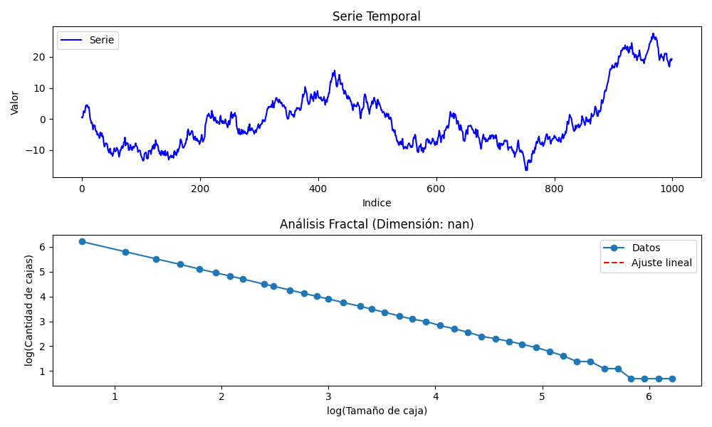

# Que es Analisis Fractal
El análisis fractal estudia estructuras y patrones que se repiten a diferentes escalas. Es útil para analizar fenómenos complejos e irregulares en diversas disciplinas como finanzas, biología, física y geografía.

## Método Box-Counting:

Divide el espacio en "cajas" de distintos tamaños.
Cuenta cuántas cajas contienen información o datos del fractal.
La relación entre el tamaño de las cajas y la cantidad utilizada determina la dimensión fractal.

### Pasos del Análisis Fractal
**Recolección de Datos**:

Series temporales, imágenes o formas (por ejemplo, datos financieros o patrones naturales).

**Normalización**:

Escalar los datos entre valores mínimos y máximos (0 a 1).

**Cálculo Box-Counting**:

Se analizan los datos a diferentes resoluciones.
Se calcula la cantidad de cajas necesarias para cubrir el patrón.

**Estimación de Dimensión Fractal**:

Se grafica la relación log-log entre el tamaño de las cajas y el número de cajas ocupadas.

___La pendiente de la línea ajustada es la dimensión fractal.___

